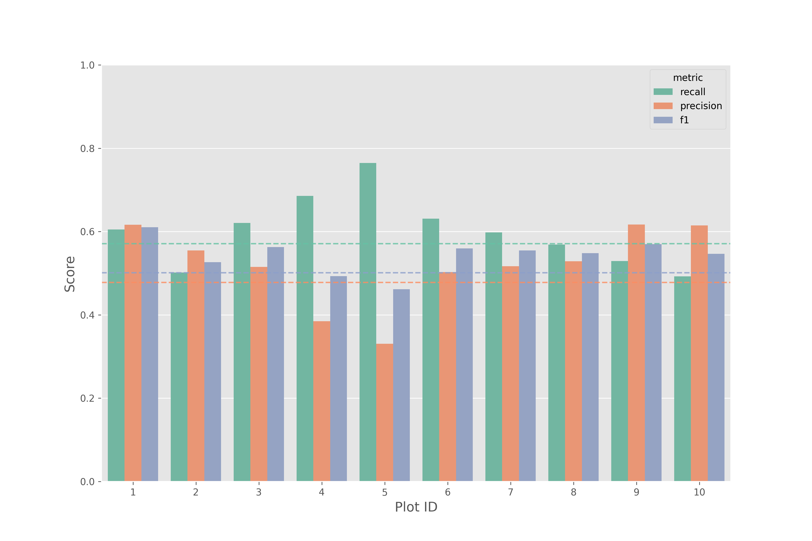

## Tree detection via LiDAR and RGB orthophoto data

This repository aims to work on the data proposed by the paper by Dubrovin, Fortin & Kedrov (2024). The project was created using [uv](https://github.com/astral-sh/uv) and has a pyproject.toml file to handle dependencies. To create a similar environmnt, `uv sync` with uv installed. To run, just active the generated venv and do: `python3 tree_detect_kd.py` Regarding the local file structure, there might be some adapatations needed to account for different local machines, as most file loading takes place using a direct call out to the file path from my own machine (this is a TODO).

The files pertaining to main detection algorithm are located in `tree_detection_algo`.

### Main algorithm approach

1.  Build a cKDTree from LiDAR points (x, y, z).

2.  For each point, query neighbors within a fixed radius.

3.  Mark the point as a local maximum if its height (z) exceeds all neighbors.

4.  Use these local maxima as potential tree tops.

5.  Cluster all points by nearest treetop (via another cKDTree query).

6.  Within each cluster, take the highest point as the final treetop..

While this approach might not be the most ideal, it yielded good results when compared to the benchmark, on average:

| Metric    | Avg   | Benchmark | 
|-----------|-------|-----------| 
| Recall    | 0.600 |0.571      | 
| Precision | 0.518 |0.478      | 
| F1        | 0.543 |0.501      | 

The results of each plot ID can be visualized in the following image:

### Possible improvements

-   In Kaggle, a great solution done by author [HEDI FEKI](https://www.kaggle.com/code/hedifeki/tree-detection) was by doing a detection based on an adaptive window idea, basically making the detections adapt to certain characteristic such as height. This would change the detected radius, for example.

### Other approaches

-   Usage of ML algorithms to classify pixels based on their r, g, b, z and intensity values are also presented inside `scripts/random_forest.ipynb`, this idea can be fleshed out further, but the main catch was to build a dataframe structure that could be applied as a supervised learning problem by taking important info from both the point cloud and RGB images.
-   This was mostly a test, showing that this is possible. I tried to match the ground survey points to their respective RGB, z and intensity values by creating a buffer around the trees. After this, concatenate some points where there were not trees via sampling. I sampled because if we just used every singles point of the point cloud / pixel of rgb image, we would have a huge dataframe, we only a few occurences of trees.
-   With this in mind, the idea of the model was to learn patterns that could discriminate between which combination of band and point cloud information were trees.
-   Feature importance was verified, showing that the point cloud intensity was the most discriminating column, which was also verified via a visual inspection of the distribution of data, available at `images/<plot_number>/distribution.png`
-   The metrics acquired can be verified in the following table. Taking a grain of salt as the model learned from a sampled dataset - ie not with the total presence of all pixels / point clouds - so this idea would have to be refined to take into consideration the heavy imbalance something like this would bring.
-   Further developments would probably involve more sophisticated models that can handle images/point clouds better, such as CNNs.

| plot_id | recall | precision | f1    |
|---------|--------|-----------|-------|
| 1       | 0.984  | 0.969     | 0.976 |
| 2       | 0.982  | 0.965     | 0.973 |
| 3       | 0.954  | 0.912     | 0.929 |
| 4       | 0.978  | 0.965     | 0.971 |
| 5       | 0.873  | 0.800     | 0.818 |
| 6       | 0.989  | 0.974     | 0.981 |
| 7       | 0.975  | 0.964     | 0.969 |
| 8       | 0.969  | 0.940     | 0.952 |
| 9       | 0.966  | 0.975     | 0.970 |
| 10      | 0.971  | 0.956     | 0.963 |
| avg     | 0.964  | 0.942     | 0.950 |

### Acknoledgements

-   This repository wouldn't be possible without the contribution of the data by the original authors, their solutions via notebook and local maxima filtering, and by the previously mentioned Hedi Feki. Took a lot of inspiration from their solution and tried to adapt to something that was closer to what I know and have used previously.
